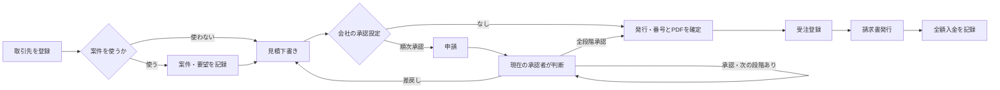

# 2. 業務フロー・画面設計

## 2.1 利用開始

ローカルの初期構築でマイグレーションを適用する。空DBなら、最初の画面で事業者名・屋号、管理者の表示名・ユーザー名・パスワードを登録し、自動ログインする。初回登録は全事業者・ユーザー・所属が0件のときに限る。登録後は同じ入口から追加できず、後続のメンバーは会社管理者が登録する。`-Demo` を明示した場合は架空の2事業者と6アカウントを投入し、初回登録をスキップする。個人用 `solo` は承認なし。チーム用 `staff` は担当者、`manager` と `director` は順次承認者、`admin` は会社管理者、`sales` は別課の権限制御確認用である。

ログイン後の開始画面は見積一覧。ナビゲーションからアトリエ、案件、承認待ち、受注、請求・入金、取引先、会社設定、操作マニュアルに移動する。アトリエは案件カードを中心に仕事の状況を表示する補助画面で、業務データは同じAPIを使用する。

## 2.2 見積の標準フロー

案件を使う場合、取引先が見積と一致することを検証する。選択した要望は版と内容のスナップショットを見積へ保存する。要望を後で更新しても発行済みの見積には自動反映しない。

## 2.3 見積・承認の状態

|現在|操作|次|条件|
|---|---|---|---|
|下書き・差戻し|編集|同左|担当者または対象範囲の管理者、最新版、更新番号一致|
|下書き・差戻し|申請|承認待ち|会社が順次承認、全段階に有効な承認者がいる|
|承認待ち|承認|次段階の承認待ち／承認済み|現在段階の承認者だけ|
|承認待ち|差戻し|差戻し|現在段階の承認者、理由必須|
|承認待ち|取下げ|下書き|申請者だけ|
|承認済み|承認を解除して編集|下書き|旧承認を無効化|
|承認済み／承認なしの下書き|発行|発行済み|番号・PDFを同じDBトランザクションで確定|
|発行済み|改版|新しい版の下書き|旧版・旧PDFを保持|

申請時に経路の版と各段階の承認者・帳票内容を固定する。会社設定を変更しても進行中の申請に影響させない。申請者・作成者の自己承認、および同じ人物による複数段階の承認を禁止し、適切な代理承認者が設定されていれば自動選択する。差戻し後の再申請は第1段階から新しい申請を作る。

## 2.4 発行・改版・PDF

初回発行時に会社別の連番で `Q-年-6桁` の番号を付ける。版は1から始まり、同一見積の改版は番号を維持して版を増やす。SQLiteの `BEGIN IMMEDIATE` で書き込み操作を直列化し、PDF生成失敗時は番号と状態もロールバックする。同じ版への発行の再試行は発行済みの結果を返す。

下書きのPDFはプレビューであり正式番号を付けない。正式発行では日本語フォントを用いてA4 PDFを生成し、バイナリとしてSQLiteファイルへ保存する。ダウンロードは保存済みバイトを返すので、会社情報や印鑑画像を後で変更しても旧版が変わらない。社内メモ・承認コメントは顧客向けPDFに出力しない。

## 2.5 受注・請求

発行済み見積の特定版から受注を1件登録する。受注日、納期、メモを持ち、進行中、完了、取消を管理する。受注の元見積版と金額は固定する。受注から請求下書きを作り、発行日時点で番号・PDFを保存する。入金確認は全額入金日・メモの記録で、未入金／期限超過を画面に示す。請求の取消・訂正は理由付き操作として履歴に残す。分割請求、部分入金、実際の銀行照合は行わない。

## 2.6 画面一覧

|画面|主な項目・操作|
|---|---|
|初回セットアップ|空DB限定で事業者名・屋号、管理者の名前・ユーザー名・パスワードを登録|
|ログイン|ユーザー名、パスワード、デモ投入時だけデモアカウント選択|
|見積一覧|状態・件名・顧客名・番号の検索、作成、詳細へ遷移|
|見積作成／詳細|宛先、明細、税率、条件、印鑑表示、プレビュー、申請、発行、改版、複製、履歴|
|承認待ち|現在の段階に到達した申請、内容確認、承認／差戻し|
|案件一覧／ノート|顧客情報、目的、要望と合意、添付、関連する見積・受注・請求|
|受注一覧／詳細|発行済み見積からの登録、納期、状態、請求作成|
|請求一覧／詳細|請求下書き、発行、PDF、全額入金確認|
|取引先|会社内の顧客名、担当者、住所、連絡先|
|会社設定|自社情報、承認方式・段階・代理、部・課、メンバー、印鑑画像|

画面上の表示制限だけで権限を保証しない。すべての読み書きでAPIが会社・役割・対象範囲を検査する。
