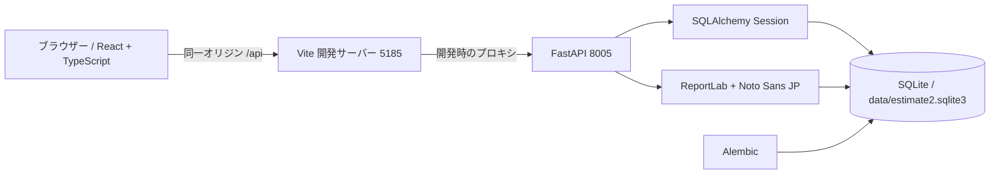

# 3. 構成・データ設計

利用者向けのWindowsデスクトップ構成は[7. デスクトップ版の設計](07-desktop-design.md)が正本です。以下のVite・ブラウザー構成はソース開発時の構成です。

## 3.1 実行構成

バックエンドはPydanticで入力を検証し、サービス処理後にSQLAlchemyセッションをコミットする。失敗時はロールバック。画面側は `frontend/src/api.ts` から `/api` を呼ぶ。データベースの変更履歴は `backend/migrations/versions` が正本で、`create_all` に依存しない。起動ポートとDB名は旧アプリから分離した。

## 3.2 主要なエンティティ

|テーブル|主キーと主な列|関係・保持目的|
|---|---|
|`companies`|id, name, approval_mode, route, route_version, next_number|事業者単位の設定・採番|
|`departments`, `sections`|id, company_id, department_id|任意の部・課|
|`users`, `memberships`, `login_sessions`|利用者、会社所属、セッション|ログインと会社別権限。ユーザーと所属を分離|
|`customers`|id, company_id, name, contact|取引先マスター|
|`projects`, `requirements`, `requirement_history`|案件、要望、要望版|案件の相談・合意記録|
|`project_attachments`|project_id, content, size_bytes, sha256|案件ごとの複数添付。バイナリはDB保持|
|`quotes`|company_id, number, owner_id, department_id, section_id|見積の同一性、担当、組織、採番|
|`revisions`|quote_id, version, status, payload, subtotal, tax, total, pdf|見積版と帳票スナップショット|
|`approval_requests`, `approval_steps`|revision_id, route_version, snapshot, approver_id, position|申請ごとに固定した承認経路と判断|
|`seals`|company_id, image, active|会社印画像の版を保持|
|`orders`|revision_id, status, amount|合意した見積版からの受注|
|`invoices`|order_id, number, status, payload, pdf, paid_on|請求版・PDF・入金確認|
|`audit_logs`|company_id, actor_id, quote_id, action, detail|主要操作の履歴|

詳細な全列と制約は `backend/app/models.py`、実際のDB生成はAlembic migrationを参照する。`company_id` を持つ主要な子テーブルには、親と同じ会社であることを保証する複合外部キーがある。顧客や帳票JSONのようにDBだけで保証しきれない参照はAPIの会社スコープ検証で補う。

## 3.3 見積版の保存

`quotes` は見積そのもの、`revisions` は版。版ごとの `payload` に宛先、発行者情報、明細、取引条件、計算済み金額、印鑑ID、選択した要望の内容を保存する。`subtotal` / `tax` / `total` は検索・集計用の数値列にも保持。顧客マスター・会社設定を後で変更しても旧版の表示内容を変えない。発行済み `pdf` は生成済みバイトを保存し、再生成しない。

明細額 = 数量 × 税抜単価を円単位で四捨五入。税率ごとに明細額を合算し、その合算 × 税率を円未満切り捨て。小計＋全税率の税額＝税込合計。計算はPythonの `Decimal` で行い、DBの集計金額は円単位整数を `NUMERIC(16,0)` 列へ保存する。SQLiteの型親和性に小数計算の正確さを依存させない。

## 3.4 同時操作と失敗時

- 状態変更のAPIは、最初の読み取り前に `BEGIN IMMEDIATE` を実行して書き込みを直列化する。更新番号 `lock_version` が合わなければ409を返す。SQLiteは行単位の `FOR UPDATE` を使わない。
- 発行時も同じ書き込みトランザクション内で会社内の連番を採番する。`(company_id, number)` と `(company_id, quote_id, version)` は一意制約。
- PDF生成・採番・状態変更を同じトランザクションに入れる。生成や保存に失敗したら発行済みにならない。
- 受注・請求は発行済みの特定版を参照し、重複を拒否する。操作履歴も同じトランザクションで記録する。

## 3.5 容量・保守の留意点

案件添付と発行PDFをSQLiteに保存するため、DBファイルのバックアップにこれらも含まれる。一方で容量増加に注意が必要。添付は1件10MB・1案件30件・合計100MBを上限とする。運用時は書き込み中のファイル単純コピーを避け、同梱の `scripts/backup.py` でSQLiteバックアップAPIを使った一貫したコピーを作る。復元試験は別途行う。自動バックアップジョブは含まない。SQLiteのWALモードと外部キー検証を有効にする。
