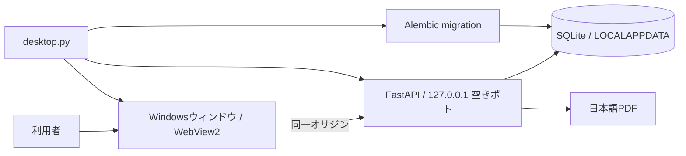

# 7. Windowsデスクトップ版の設計

## 7.1 目的と構成

見積管理の業務仕様・API・SQLiteモデル・React画面を保ち、Windows上ではブラウザーと開発サーバーを手動起動せず利用できるようにする。`desktop.py` が起動点であり、Alembicを最新版へ適用した後、FastAPIをループバックの未使用ポートに起動し、ビルド済みReact画面をpywebviewのEdge WebView2ウィンドウで開く。ウィンドウを閉じるとAPIスレッドを停止し、SQLAlchemyの接続を解放する。

配布フォルダー内に`frontend/dist`、`backend/migrations`、`backend/assets`、`alembic.ini`、操作マニュアルを含める。PyInstallerの`onedir`形式とし、EXEだけでなく同じフォルダーの`_internal`も必要。ソース版では`.env`の`DATABASE_URL`を使い、配布版の既定DBは`%LOCALAPPDATA%\Estimate2\estimate2.sqlite3`。引数`--database`で任意のファイル型SQLiteを指定できる。

## 7.2 セキュリティとデータ

APIは`127.0.0.1`だけに待ち受け、ランダムな空きポートを使う。起動ごとに推測困難な秘密値を生成し、WebView2だけに起動URLで渡す。`/api/desktop/launch`は秘密値を照合してHttpOnlyの起動Cookieを発行し、秘密値のないURLへリダイレクトする。初回は事業者名・表示名だけで所有者を作り、既存DBの有効な所属が1件だけなら`/api/desktop/resume`でセッションを発行する。画面にパスワード入力を要求しない。複数所属があるDBでは自動選択せず、従来のログイン画面を使う。

既存のセッションCookie、会社分離、書き込みOrigin検査を継続し、デスクトップの実際のOriginを許可リストに追加する。起動CookieとセッションCookieは別で、起動Cookieだけでは業務APIを利用できない。DBとWebView2プロファイルはユーザー別のローカルアプリデータに保存する。ウィンドウの「ファイル → データをバックアップ」はSQLiteのbackup APIで一貫したコピーを作り、`PRAGMA integrity_check`を通したときだけ成功を表示する。配布ZIPにDB・`.env`・秘密情報は入れない。

ループバックAPIはローカルホストの他プロセスから到達し得るため、秘密値照合、セッション、Origin検査を省略しない。同じWindowsアカウントで動く別プロセスはDBファイル自体にアクセスし得るので、OSアカウントを信頼境界とする。現仕様はローカル個人利用を想定し、ネットワークサービスとしての外部公開は対象外。EXEの更新ではDBを上書きせず、起動時にAlembicでスキーマを更新する。重要な更新前にはバックアップを取る。

## 7.3 受入条件

1. 空DBから起動すると事業者名・表示名だけで初期設定でき、再起動後はログイン入力なしで開く。
2. アプリウィンドウから見積・PDFなどの既存業務が操作でき、APIはループバック以外に待ち受けない。
3. 空DBと既存DBの両方でAlembic適用後にAPI・React画面のヘルスチェックが成功する。
4. 書き込みOrigin検査はデスクトップOriginを許可し、無関係なOriginを拒否する。
5. バックアップはDB整合性を満たし、PDF・添付などDB内の全データを含む。
6. 配布ZIPから展開したフォルダーのEXEがWindows上で起動し、ユーザーデータを配布フォルダー外に保存する。
7. 秘密値を知らないクライアントは起動・再開APIを使えず、複数ユーザーのDBは自動ログインしない。

利用手順と復元方法は[デスクトップ版の使い方](../desktop.md)を参照。既存のHTTP API契約と業務上の受入条件は`01`〜`06`を適用する。
